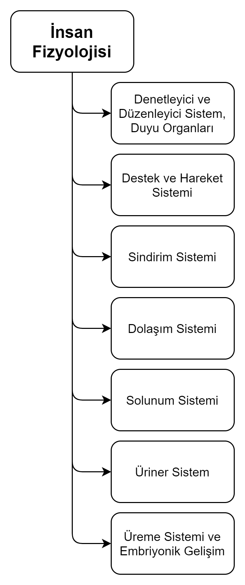

# 1. Ünite İnsan Fizyolojisi
Fizyoloji: Doku ve organların işleyişini inceler.

:star: Vücudumuzda: Hücre → Doku → Organ → Sistem → Organizma

***DOKU:*** Özelleşmiş hücre gruplarıdır. Döllenmeden sonra zigot oluşur. Zigot mitoz bölünmelerde morula, blastula ve gastrula evreleri oluşur. Gastrula evresinde *ektoderm*, *endoderm*, *mezoderm* stabakaları oluşur. Bu tabakalar köken dokulardır. Bu tabakalardan çeşitli dokularımız oluşur.

**Dokular:** 
1.	Epitel Doku
2.	Temel Bağ Doku
3.	Kas Doku
4.	Sinir Doku

***Epitel Doku:*** Vücudun içini ve dışını örter, salgı bezlerini oluşturur.

***Temel Bağ Doku:*** Canlı hücrelerden ve hücre arasını dolduran maddelerden oluşur.

+ Fibroplastlar bağ doku lifleri ve ara madde sentezler.
+ Makrofajlar savunma hücreleridir.
+ Pigment hücreleri melanin pigmenti bulundurur.
+ Mast hücreleri heporin ve histamin sentezler.
+ Plazma hücreleri antikor sentezler.
+ Bağ dokunun ara maddesi lifler ve jelatinimsi maddedir.
+ Lifler ise kolajen, elastik ve fibröz olarak üç tiptir.

Bağ dokunun ara maddesi lifler ve jelatinimsi maddedir. Lifler ise kolajen, elastik ve fibröz olarak üç tiptir.