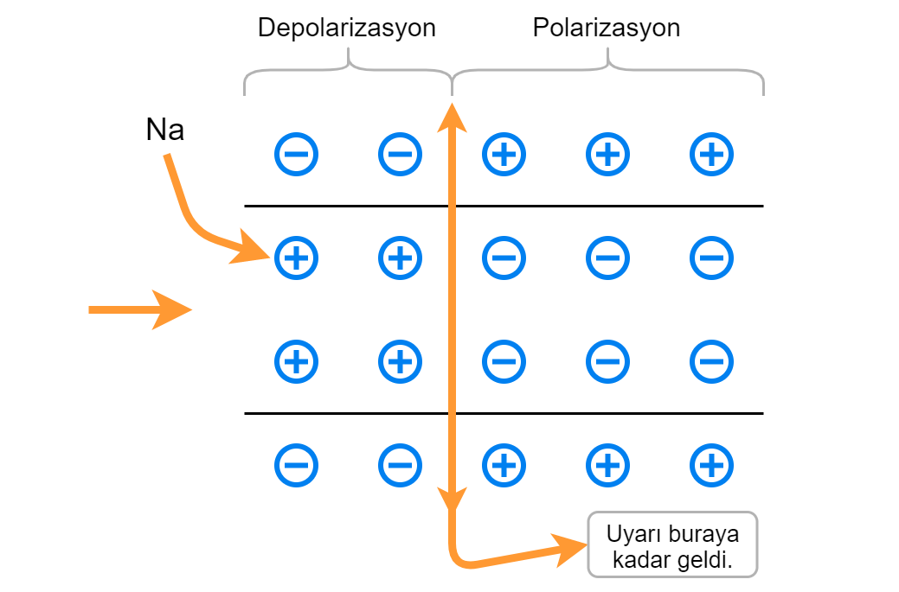
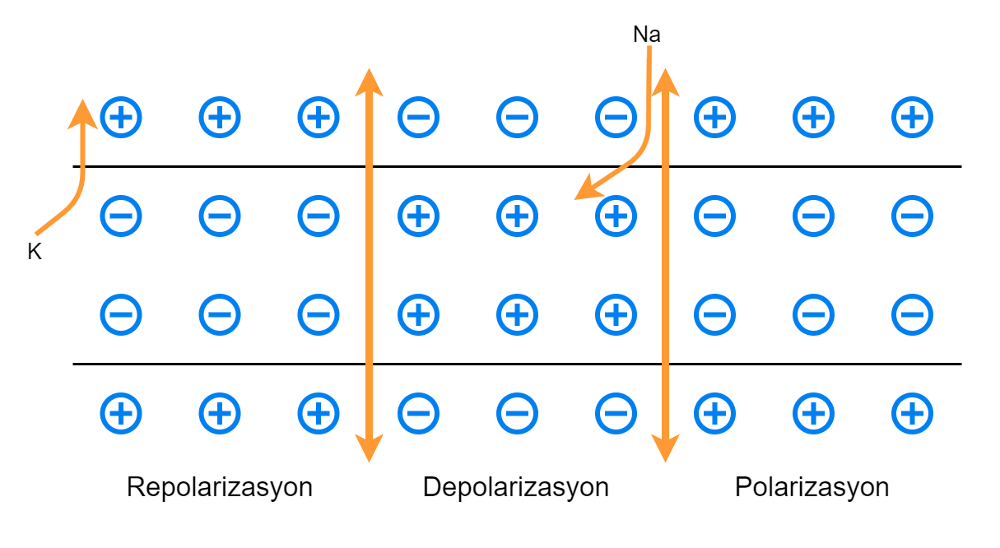
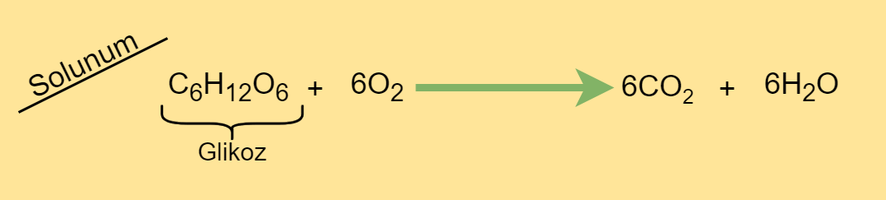

# İmpuls Oluşumu ve İletimi

.png)

Sinirde iletim gerçekleşirken I. Norönun dendritinden alınan uyarı I. Norönun gövdesinden aksonuna ilerler. (1 (Nöronda iletim))
    
Akson uçlarından sinaptik boşluğa nörotransmitter(nörohormon) salgılanır ve iletim II. Nöronun dendritine ilerler. (2)

+ İletim dendritten aksona doğrudur.
+ :star: Sinaptik boşlukta aksondan dendrite doğru olur.
---
## 1- Nöronda İmpuls Oluşumu ve İletimi
+ Hücre tek başına değildir. Etrafında başka hücreler, içinde ve dışında pek çok kimyasal madde vardır: *Na, K, Mg, Cl, HCO3 ; Glikoz, Aminoasit, Fosfolipit, Kolesterol, Protein, Nötral yağ.*

.png)

+ Bu bileşenlere bakıldığında hücre dışı sıvıda Na+ iyonlarının K+ iyonlarından fazla olduğu görülür.
+ Hücre zarında bulunan taşıyıcı proteinler ve protein kanlları lipitten geçemeyen büyük moleküllerim ve suyun geçişini kontrol eder.
+ Bu proteinler belli maddelere karşı seçici ve geçirgendir ve açılıp kapanabilen kapılar gibidir.

Örneğin potasyum kanalları → K, sodyum kanalları → Na geçirgenliğini hızlandırır. Böylece hücre içi ve dışı elektrik yükü farkı oluşturur.

:star: Akson boyunca iletimde sırasıyla polarizasyon, depolarizasyon ve repolarizasyon olayları gerçekleşir.

---
>### POLARİZASYON:
> Dinlenme halindeki nöronda oluşan kutuplaşmadır.
>.png)
>+ Hücre dışı artı(+) hücre içi eksi(-) yüklüdür.
>+ Oluşan bu yük farkına zar potansiyeli denir.
>+ Nöron uyarı almadıysa dinlenme potansiyeli denir. 
>
>>#### *Na-K Pompası:*
>>Na dışarı K içeri pompalanır.  
>>:star::star:Difüzyona karşı koyduğu için Na-K Pompası   ***ATP harcar.*** (aktif taşıma) :star::star:
>>.png)
>>
>- Hücre içi elektrik farkı -70mV’dur.
>
---
>### DEPOLARİZASYON:
>+ Nöron uyarılınca Na kapıları açılır Na hücre içine difüzyonla geçer.
>+ Hücre içi artı(+) dışı eksi(-) yüklenir.  
>  
>-Uyarının geldiği akson kısmı depolarize olur. Uyarının geçemediği diğer kısım hâlâ polarizedir.
---
>### REPOLARİZASYON:
>+ Nöronun yeni uyarı alabilmek için eski kutuplaşma haline dönmesidir.
>+ Na kapıları kapanır, K kapıları açılır. K difüzyonla atılır.

+ Nöronun tekrar uyarı alabilmesi için Na-K iyon derişiminin tekrar eski haline dönmesi gerekir. Na-K pompası çalışır. ***ATP harcanır.***
+ Nöronun zar potansiyelindeki bu değişikliklere *aksiyon potansiyeli* denir.

>  
>III. → Uyarı henüz buraya gelmemiş ilk haliyle bekliyor.  
>II. → Uyarı almış, yük değişimi olmuş.  
>I. → Tekrar yük değişimi olup eski haline dönmüş.  

+ Repolarizasyonda ve polarizasyonda Na-K pompası çalışır.
+ Polarizasyonda dışarıda Na fazlayken, depolarizasyonda K fazladır.
+ Miyelinli nöreonlarda iyon geçişi ranvie boğumlarda gerçekleşir.
+ Ca+2 kanalı Na-K popmasını güçlendirir. (Hücre içine Ca geçişi)
+ Zayıf bir uyarı nöronu uyarmaz. Uyarının tüm hücre boyunca yayılabileceği değere sahip olması gerekir. Bu değer ***EŞİK DEĞER***dir.

Eşik değer ve üzerindeki değerlere nöron aynı şiddette impuls oluşturur. Buna *YA HEP YA HİÇ* kuralı denir. (Eşiğin altına hiç tepki yok, eşik değer ve üzerine aynı şiddette tepki) (Aksiyon potansiyeli)

#TODO: mV grafiği eklenecek

## 2- Sinapsta İmpuls İletimi
.png)

Nöronun diğer nöronla veya kas ve salgı beziyle karşılatığı yer *sinapstır.*
+ Uyarı elektriksel iletimle akson ucuna eriştiğinde hücreye *Ca+2* girer.
+ Nörotransmitterleri taşıyan keseler sinaptik boşluğa nörotransmitter salgılar.

Nörotransmitter(Nörohormon): Asetilkolin, nörepinefrin, histamin, adrenalin, dopamin, serotonin, glutamat gibi maddeler nörotransmitterdir.

+ Nörohormonlar sinaptik boşlukta difüzyonla yayılır.
+ Bu maddeler 2. nöronun hücre zarındaki reseptörlere bağlanır.
+ 2\. nöronun zar geçirgenliği değişir impuls başlamış olur.(Efektörün tepkisi gerçekleşir.)
- İletim bittikten sonra sinapstaki nörotransmitter madde *enzimler* tarafından parçalanır.
- Bir nöron birden çok nöronla sinaps yapabilir.
- Nörohormonlar bazen depolarizasyona yol açıp uyartı iletimini sağlarken (kolaylaştırılmış sinaps) bazen yüksek polarizasyona neden olup iletimi engelleyebilir (durdurucu sinaps).
- Art arda nörona gelen uyarılar sinaptik uyarının(iletimin) yavaşlamasına ve yorulmasına sebep olur.
- İletimin yorulması bazı durumlarda sigorta görevindedir.
- :star: :star: ***HİPERPOLARİZASYON***= Repolarizasyonda polarizasyona geçerken K kapıları yavaş kapandığı için bir miktar K dışarı cıkar. Bu olay hiperpolarizasyondur. Na-K pompası devreye girince polarizasyona döner.
- Sinapslarda iletim *kimyasaldır*, yavaştır.(Aksondan dendrite doğrudur.)
- İmpuls iletiminde O2, glikoz, ATP azalır. CO2, H2O, ısı artar.

(ATP oluşturulur ve harcanır. ADP artar.)
