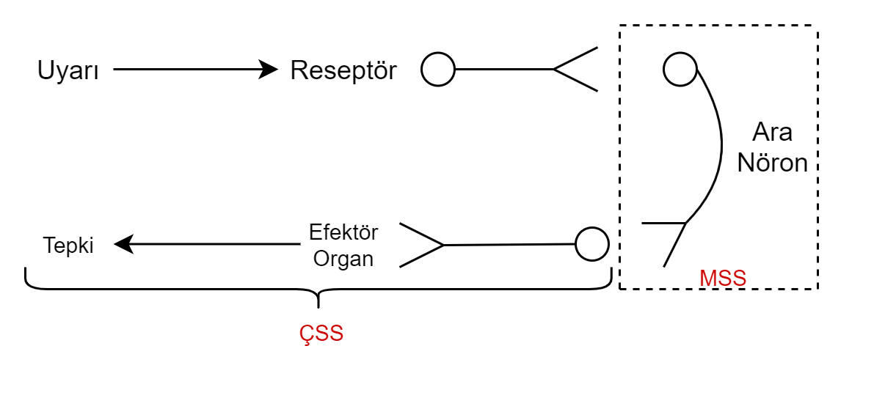
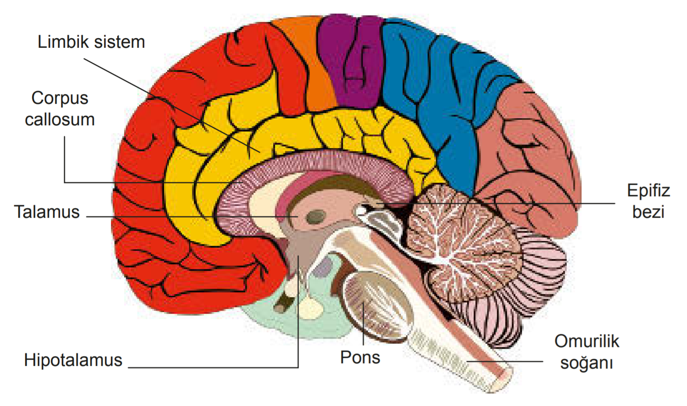

# Görevlerine Göre Nöronlar
**Duyu Nöronu:** Duyu organlarından veya diğer organlardan aldıkları uyartıları merkezi sinir sistemine (MSS)(beyin ve omurilik) iletirler.
**Ara Nöron:** MSS'de bulunurlar. Duyu nronun getirdiği uyarıları değerlendirir, değerlendirme cevabını motor nörona iletir.
**Motor Nöron:** MSSden aldığı cevabı tepki organına taşır.
>Duyu Nöronu = Afferent = Getirici  
>Aferin MSS'ye *getir*din.

>Motor Nöron = Efferent = Götürücü  
>Motorlu Efe *götür*ür.

* *Ara nöron* zarar görürse → uyarı değerlendirilemez, tepki veremez. (Kalıcı felç)
* Duyu nöronu zarar görürse → hissedilemez. (lokal anestezi=bölgesel uyuşma)
* *Motor nöron* zarar görürse → tepki verilemez. (botoks uygulaması)

:star::star: Shwann hücrelerinden miyelin üretimi ÇSS'de, oligodendrositlerden miyelin üretimi MSS'de gerçekleşir.

>## *Dikkat!*
>* Nörontransmitterler sinaptik boşluğa ekzositozla atılır. (ATP harcar)
>* Sinir dokudaki bazı hücreler:
>
>   * *Schawann hücreleri* = ÇSS için miyelin oluşturur.
>   * *Oligodendrosit* = MSS için miyelin oluşturur.
>   * *Mikroglia* = MSS makrofajlarıdır.
>   * *Ependim hücreleri* = Beyin omurilik sıvısı(BOS) üretir.
>   * *Astrosit* = Beyin ve omurilikte yıldız şekilli hücrelerdir. Nörokimyasal çevreyi ve iyon dengesini düzenler.

*Mahmut Gazi Yaşargil* = Sinir sistemi ve beyin fonksiyonları üzerine çalışmıştır.

----

.png)

# Merkezi Sinir Sistemi (Beyin ve Omurilik)
- Beyin ve omurilik üç katlı zar ile sarılmıştır.
- Dıştan içe: *sert zar → örümceksi zar → ince zar*
- Bu üç zar katmanına  **MENİNGES** zarları denir. Hastalığı, iltihaplanması **menenjit** hastalığıdır.

* Sert zar → beyni korur.
* Örümceksi zar → sert ve ince zarı birbirine bağlar.
* İnce zar → beyni besler. (Damarlar az geçirgendir. Zararlı maddeleri geçirmez.)

BOS(Beyin Omurilik Sıvısı) = Örümceksi zar ile ince zar arasındadır. Beyin ve omuriliği darbelerden korur. Madde alışverişi ve iyon dengesi sağlar. Hastalık teşhisinde kullanılır.

:star: Beyin ve omurilikte ara nöron ve motor nöron ***gövdeleri*** bulunur.

---
## Beyin

### Ön Beyin: 
Beynin en büyük bölümüdür.
* Uç Beyin: 
    * İki yarım küreden oluşur.(Haberleşmelerini corpus callosum sağlar.)
    * Yarım küreleri ayıran yarığa *ROLANDO YARIĞI* denir.
    * Yarım küreler üstte *nasırlı cisim*, altta *beyin üçgeniyle* bağlıdır.
    * Enine kesitte:
        * Dış → boz madde (Nöron gövdeleri) boz madde → KORTEX
        * İç → ak madde (Miyelinli Akson)
* Ara Beyin:
    * Talamus, hipotalamus, epitalamus

:star: Uykuda talamus ve kortex çalışmaz.

---
### Orta Beyin:
Ara beyin ile beyincik arasındadır. Duyma ile ilgili tüm aksonlar ya burada sonlanır ya da buradan uç beyne gider.

### Arka Beyin:
Omurilik ve orta beynin birleşme bölgesindedir. Beyincik ve omurilik ve pens olarak üç kısımdır.
* ***Beyincik:*** Hareket ve denge için iç kulak ve göz verileri değerlendirilir. 
    * Beyincik hasar görürse yürümede bozukluk ve denge kaybı görülür.
* ***Omurilik Soğanı:***(son beyin)(iç=boz,dış=ak) Beyinden çıkan sinirler burada çapraz yapar, omuriliğe gider. Sağ tarafı kontrol eden sinirler beynin sol kısmında, sol kısmı kontrol eden sinirler beynin sağ kısmında bulunur. 
    * Omurilik soğanı darbe alırsa bilinç ve refleks kaybı, solunum ve kalp durması olabilir.
* ***Pons:*** Sadece memelilerde bulunur.

#### **ORTA BEYİN + PONS + OMURİLİK SOĞANI = BEYİN SAPI**

---
## Omurilik
* Omurilik soğanının altından başlayarak omurga kemikleri içinde uzanır.
* Meninges zarları ve BOS bulunur.
* Enine kesitte ***dışta → ak***(miyelinli sinir telleri, akson), ***içte → boz***(ara nöronlar, nöroglialar, kan damarları) madde bulunur.
